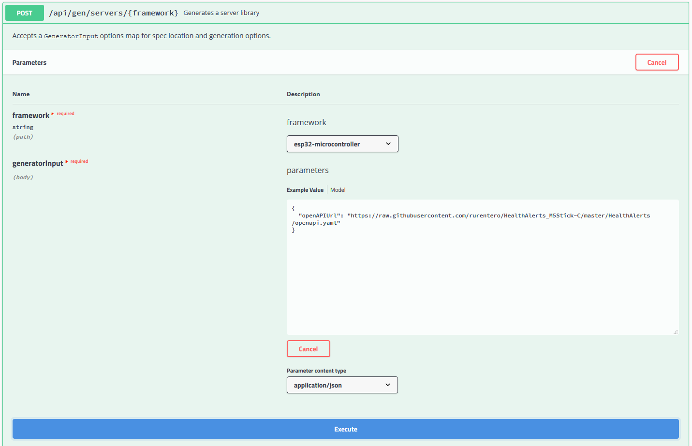
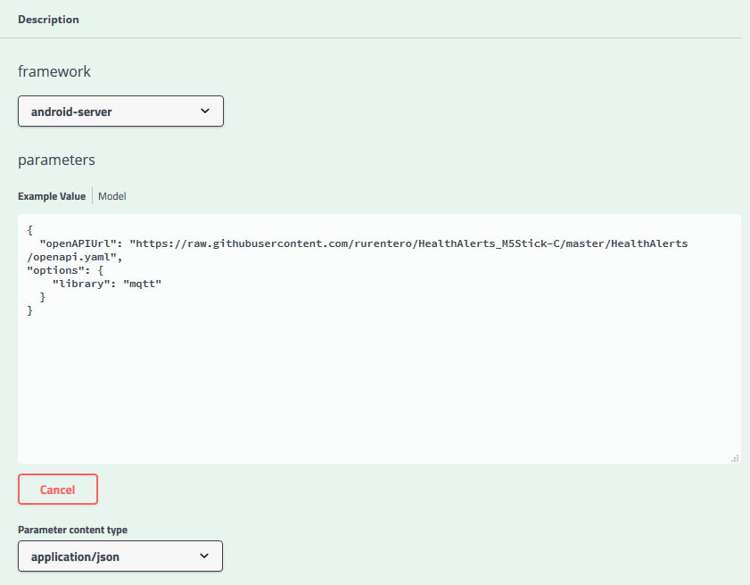
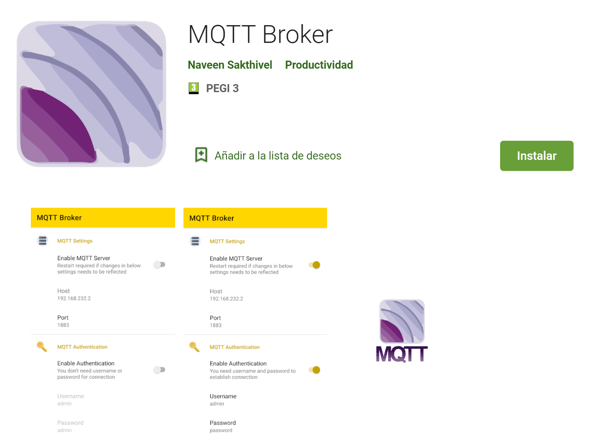

# Introducción

Este documento muestra paso a paso el proceso a seguir para la generación de código en dispositivos Android y Microcontroladores (Esp32) a partir de una especificación OpenAPI.

Se genera código fuente para el despliegue de un servidor en los dos dispositivos y se explica la estructura del servidor generado.

Como caso de uso se propone un escenario para su implementación y prueba en dispositivos reales. Para la implementación, **se proporcionan los fragmentos de código** que hay que incluir en el proyecto generado.


# 1. Requisitos previos

Para llevar a cabo los pasos de este documento son necesarios los siguientes elementos:

- Arduino IDE
- Android Studio
- Dispositivo móvil con Android (mínimo API 23)
- Microcontrolador Esp32


# 2. Escenario

María se encuentra fuera de casa durante el día por cuestiones laborales, por ello, desea tener una forma de conocer el estado de salud de su padre Juan, de 82 años. La solución debe ser cómoda para ella al mismo tiempo que debe ser muy sencilla de utilizar para Juan, que no está familiarizado con la tecnología.

María instalará en su móvil una aplicación Android con la que puede conocer en todo momento el estado de salud de Juan, como por ejemplo, su temperatura. Mientras tanto, Juan puede avisar de una situación de emergencia con solo pulsar el botón de su pulsera, esto lanzará una alerta en la aplicación de María y le mostrará su localización.

Para este escenario se parte de una especificación OpenAPI a la que se le ha dado el nombre de **Health Alerts**.


# 3. Generación de código: Esp32

Para este escenario se va a utilizar el M5-Stick-C, un modelo compacto con un microcontrolador Esp32 integrado.


## 3.1. Generar el servidor a partir de la especificación

**Generador** OpenAPI: http://openapi-generator-spilab-beta.herokuapp.com/swagger-ui.html

**Especificación** OpenAPI para Health Alerts: https://raw.githubusercontent.com/rurentero/HealthAlerts_M5Stick-C/master/HealthAlerts/openapi.yaml




### 3.1.1. Dependencias

Es necesario añadir una serie de librerías a Arduino para el correcto funcionamiento del proyecto:

- **Gestor de tarjetas**:
  - esp32
    - Si no aparece, en Archivo > Preferencias > Gestor de URLs, añadir la siguiente [URL](https://raw.githubusercontent.com/espressif/arduino-esp32/gh-pages/package_esp32_index.json), guardar y volver a buscar.
  - La configuración de la placa (opción Herramientas) es:
    - Placa: Esp32 Pico Kit
    - Upload Speed: 115200
- A través del **gestor de librerías**:
  - WiFi.h
  - PubSubClient.h
  - ArduinoJson.h
  - M5StickC.h
- **Instalación manual** en la carpeta de proyecto para usar el módulo de temperatura:
  - Descargar [DHT12.h](https://github.com/m5stack/M5StickC/blob/master/examples/Hat/ENV/DHT12.h) y [DHT12.cpp](https://github.com/m5stack/M5StickC/blob/master/examples/Hat/ENV/DHT12.cpp) y pegar en **/src/utils**

### 3.1.2. Estructura

De todo el código generado, sólo es necesario tocar los ficheros ubicados en la carpeta **Resources** y el programa principal **.ino**.


## 3.2. Implementación: Parte servidora

Este código es para la parte servidora de la pulsera, que se encarga de contestar a las peticiones entrantes, por tanto, se deben implementar los métodos de **StatusResource**.


Incluir dependencias en `StatusResource.h`

```c++
// Temperature sensor
#include <Wire.h>
#include "../utils/DHT12.h"
```


Añadir 2 atributos nuevos en `StatusResource.h`

```c++
class StatusResource {

    MqttService *mqttService;
    DHT12 dht12; 
    char* topicResponse = "HealthAlertsAndroid";
```


Método *getTemperature* en `StatusResource.cpp`

```c++
    void StatusResource::getTemperature (int &sender) {
        // TODO Mocked response
        Serial.println("Method: getTemperature");

        // Read temperature
        float tmp = dht12.readTemperature();

        Serial.println(tmp);

        // Convert to string
        char temperature[6];
        dtostrf(tmp,5,2,temperature);

        // Build and sends the json
        char *head = "{\"temperature\": ";
        char *tail = "}";
        char res[30];
        strcpy(res, head);
        strcat(res, temperature);
        strcat(res, tail);

        Serial.println(res);

        mqttService->sendResponse(topicResponse,res);
    }
```

Método *getUser* en `StatusResource.cpp`

```c++
    void StatusResource::getUser (int &sender) {
        // TODO Mocked response
        Serial.println("Method: getUser");
        
        User res = User("05461A54","84 years old. Male. Lives alone.");
        mqttService->sendResponse(topicResponse, (char*) JsonUtil::serializeUser(res));
    }
```


## 3.3. Implementación: Parte cliente

La parte cliente se encarga de iniciar la comunicación cuando se produce una alerta al pulsar un botón. En Arduino, este tipo de comportamiento se implementa en el método *loop()*.

Detectar el botón en `Esp32_MQTT.ino`.

```c++
void loop() {
    // MQTT listener
    client.loop();
    // wait for push button 
    if(digitalRead(M5_BUTTON_HOME) == LOW){ 
      while(digitalRead(M5_BUTTON_HOME) == LOW); 
      EventResourceController.sendAlert();
      printAlert();
    }
}
```


Crear el nuevo método ***sendAlert*** que implementará la alerta.

Añadimos el atributo y el nuevo método en `EventResource.h`.

```c++
class EventResource {

    MqttService *mqttService;
    char* topicResponse = "HealthAlertsAndroid";

public:
    EventResource(MqttService *_mqttService);

    void postEvent (Event &_event, int &sender);
    void sendAlert ();
};
```

E implementarlo en `EventResource.cpp`.

```c++
    // Post an event as a client
    void EventResource::sendAlert () {

    	// Creates a new location
    	Location loc = Location(39.47903,-6.342139,20);
	    // Creates a new event
	    Event alert = Event(1,"Need help!","I have fallen",loc);
	    // Sends the event/alert
        char *head = "{\"resource\": \"Event\",\"method\": \"postEvent\",\"sender\": \"11\",\"params\": {\"event\":";
        char *tail = "}}";
        char res[300];
        strcpy(res, head);
        strcat(res, (char*) JsonUtil::serializeEvent(alert));
        strcat(res, tail);

	    mqttService->sendResponse(topicResponse, res);
	}
```


# 4. Generación de código: Android


## 4.1. Generar el servidor a partir de la especificación

**Generador** OpenAPI: http://openapi-generator-spilab-beta.herokuapp.com/swagger-ui.html

**Especificación** OpenAPI para Health Alerts: https://raw.githubusercontent.com/rurentero/HealthAlerts_M5Stick-C/master/HealthAlerts/openapi.yaml




## 4.2. Configuración inicial

El proyecto generado se ha abierto con Android Studio, el cual se encargará de instalar las dependencias necesarias en caso de que no existan previamente.

Para las pruebas en Android se recomienda el uso de un teléfono físico en lugar del emulador esencialmente por dos motivos:

* Rapidez a la hora de desplegar y usar la aplicación.
* El emulador presenta más problemas de conectividad a la hora de trabajar con elementos externos de forma conjunta.


## 4.3. Implementar los métodos del servidor

En Android, la estructura general del proyecto es la misma. Para implementar la parte servidora, es necesario completar los métodos definidos en las clases de la carpeta `resource`.

Para el caso de las alertas, el móvil actuará como servidor mientras que la pulsera será quien inicie la conexión mediante un `postEvent`.

Completar el método `postEvent` de `EventResource.java`.

```java
  public String postEvent (Event event){
      // Toast for notification
      Toast toast = Toast.makeText(context, "Alert!: "+event.getTitle()+" - "+event.getDescription(), Toast.LENGTH_LONG);
      toast.show();

      // Creates an Intent that will load a map with a mocked location
      Double lat = event.getLocation().getLatitude();
      Double lon = event.getLocation().getLongitude();
      Uri gmmIntentUri = Uri.parse("geo:"+lat+","+lon+"?q="+lat+","+lon+"("+event.getTitle()+" - "+event.getDescription()+")");
      Intent mapIntent = new Intent(Intent.ACTION_VIEW, gmmIntentUri);
      mapIntent.setPackage("com.google.android.apps.maps");
      context.startActivity(mapIntent);

      return null;
  }
```

Lo que se ha hecho en este método es procesar la información obtenida y crear un Intent destinado a la aplicación Google Maps de Android. Al lanzarse, se abrirá Google Maps en la localización que se ha especificado y con el mensaje de alerta definido.

## 4.4. Implementar la parte cliente

El proyecto generado automáticamente está pensado para actuar como un servidor. Si queremos que además actúe como cliente, es necesario hacer algunos cambios. Los cambios introducidos seguirán la misma estructura ya definida por el proyecto.

### 4.4.1. Métodos del cliente

Primero, para las tareas del cliente se crea un nuevo paquete `client` dentro de `org.openapitools.server`. Dentro, se crea una nueva clase java llamada `StatusClient`, que contiene los métodos del cliente relacionados con el tipo de recurso *Status*:

- *getTemperature*
- *getUser*

Clase `StatusClient`:

```java
package org.openapitools.server.client;

import android.content.Context;
import android.content.Intent;

import androidx.localbroadcastmanager.content.LocalBroadcastManager;

import org.json.JSONException;
import org.json.JSONObject;

public class StatusClient {
    private Context context;

    public StatusClient(Context context) {
        this.context = context;
    }

    public void executeMethod(JSONObject data){
        if (data.has("id")&&data.has("details")){
            getUser(data);
        } else {
            getTemperature(data);
        }
    }

    private void getTemperature(JSONObject data) {
        //Change state on MainActivity TextView
        try {
            String temp = data.get("temperature").toString();
            Intent intentDevice = new Intent();
            intentDevice.putExtra("clientMessage", temp);
            intentDevice.setAction("CLIENTNOTIFICATION");
            LocalBroadcastManager.getInstance(context.getApplicationContext()).sendBroadcast(intentDevice);
        } catch (JSONException e) {
            e.printStackTrace();
        }
    }

    private void getUser(JSONObject data) {
        //Change state on MainActivity TextView
        try {
            String id = data.getString("id");
            String details = data.getString("details");

            Intent intentDevice = new Intent();
            intentDevice.putExtra("clientMessage", "ID: "+id+". Details: "+details);
            intentDevice.setAction("CLIENTNOTIFICATION");
            LocalBroadcastManager.getInstance(context.getApplicationContext()).sendBroadcast(intentDevice);

        } catch (JSONException e) {
            e.printStackTrace();
        }
    }
}
```


### 4.4.2. Modificación del servicio MQTT

Como se ha comentado antes, el funcionamiento está pensado para actuar como servidor y no como cliente, por este motivo se va a **modificar el comportamiento del servicio de MQTT** para que pueda distinguir entre los mensajes de la parte servidora y los de la parte cliente.

En la clase `MQTTService` del paquete `service`, modificar el método `messageArrived`.

```java
@Override
public void messageArrived(String s, MqttMessage mqttMessage) throws Exception {
    Log.d(TAG, " - Message!!");

    // Parse message
    String msg = new String(mqttMessage.getPayload());
    JSONObject json = new JSONObject(msg);

    Log.i("Msg received by MQTT: ", json.toString());
    // TODO Client: Split messages into server messages and normal/responses messages (client)
    if(json.has("resource") && json.has("method")){
        Log.i("Received: ", "API Request");
        executeAPI(json);
    } else {
        Log.i("Received: ", "Client Response");
        executeClient(json);
    }
}
```

En la clase `MQTTService` también hay que crear el siguiente método, que será el encargado de ejecutar los métodos correspondientes.

```java
private void executeClient(JSONObject data) throws JSONException {
    new StatusClient(getApplicationContext()).executeMethod(data);
}
```

Finalmente, para poder acceder al servicio en cualquier momento recuperando su instancia, definir el siguiente método en la clase `MqttClient`.

```java
public MqttAndroidClient getMqttAndroidClientInstance() {
    return mqttAndroidClient;
}
```


### 4.4.3. Layout de la aplicación

Llegados a este punto es momento de definir lo que verá el usuario en su aplicación Android.

Primero, **modificar** el layout principal y añadir dos botones, uno para obtener la temperatura y otro para obtener al usuario de la pulsera. El layout se encuentra en `res` > `layout` > `activity_main.xml` y se puede modificar rápidamente sustituyendo el código por el siguiente.

```xml
<?xml version="1.0" encoding="utf-8"?>
<LinearLayout xmlns:android="http://schemas.android.com/apk/res/android"
              xmlns:app="http://schemas.android.com/apk/res-auto"
              xmlns:tools="http://schemas.android.com/tools"
              android:layout_width="match_parent"
              android:layout_height="match_parent"
              android:orientation="vertical"
              tools:context=".MainActivity">

    <TextView
        android:id="@+id/tokenTittle"
        android:layout_width="wrap_content"
        android:layout_height="wrap_content"
        android:layout_gravity="center_horizontal"
        android:layout_marginTop="8dp"
        android:layout_weight="1"
        android:text="MQTT Connection"
        android:textAppearance="@style/TextAppearance.AppCompat.Body1"
        android:textSize="22sp" />

    <TextView
        android:id="@+id/mqttState"
        android:layout_width="wrap_content"
        android:layout_height="wrap_content"
        android:layout_gravity="center_horizontal"
        android:layout_margin="8dp"
        android:layout_weight="1"
        android:text="Not Connected"
        android:textIsSelectable="true"
        android:textSize="16sp" />

    <TextView
        android:id="@+id/notificationTittle"
        android:layout_width="wrap_content"
        android:layout_height="wrap_content"
        android:layout_gravity="center_horizontal"
        android:layout_marginTop="8dp"
        android:layout_weight="1"
        android:text="Notifications"
        android:textAppearance="@style/TextAppearance.AppCompat.Body1"
        android:textSize="20sp" />

    <ListView
        android:id="@+id/list_notification"
        android:layout_width="match_parent"
        android:layout_height="400dp"
        android:layout_weight="4"
        android:listSelector="@android:color/transparent" />

    <TextView
        android:id="@+id/ClientView"
        android:layout_width="match_parent"
        android:layout_height="wrap_content"
        android:layout_gravity="center_horizontal"
        android:layout_margin="8dp"
        android:layout_weight="4"
        android:text="Client Log"
        android:textIsSelectable="true"
        android:textSize="16sp" />

    <Button
        android:id="@+id/button"
        android:layout_width="match_parent"
        android:layout_height="wrap_content"
        android:layout_weight="1"
        android:text="Get User" />

    <Button
        android:id="@+id/button2"
        android:layout_width="match_parent"
        android:layout_height="wrap_content"
        android:layout_weight="1"
        android:text="Get Temperature" />
</LinearLayout>
```


### 4.4.4. MainActivity

El último fichero a modificar es el correspondiente a la actividad principal de la aplicación, `MainActivity`. Esencialmente se va a configurar el funcionamiento de los dos botones para el usuario y la sección donde aparecerán los mensajes.

Primero se declara un atributo para la sección de mensajes y otro para usar el cliente MQTT.

```java
private TextView clientView;
private MqttClient mqttClient = new MqttClient();
```

A continuación, por un lado se obtiene el cliente MQTT con el que se establecerá la conexión al pulsar los botones, por otro se configura el funcionamiento de los mismos. Cada botón muestra un mensaje de aviso de la acción que se está realizando y crea la petición.

```java
        clientView = (TextView) findViewById(R.id.ClientView);

        MqttAndroidClient mqttAndroidClient = mqttClient.getMqttClient(getApplicationContext(), MQTTConfiguration.MQTT_BROKER_URL, "AndroidClient");

        Button button = (Button) findViewById(R.id.button);
        button.setOnClickListener(new View.OnClickListener() {
            public void onClick(View v) {
                // Do something in response to button click
                Toast toast = Toast.makeText(getApplicationContext(), "Solicitando usuario", Toast.LENGTH_SHORT);
                toast.show();

                String msg = "{\n" +
                        "\t\"resource\": \"Status\",\n" +
                        "\t\"method\": \"getUser\",\n" +
                        "\t\"sender\": \"11\",\n" +
                        "\t\"params\": {\t}\n" +
                        "}";
                try {
                    mqttClient.publishMessage(mqttClient.getMqttAndroidClientInstance(), msg, 1, "HealthAlerts");
                } catch (MqttException e) {
                    e.printStackTrace();
                } catch (UnsupportedEncodingException e) {
                    e.printStackTrace();
                }
            }
        });

        Button button2 = (Button) findViewById(R.id.button2);
        button2.setOnClickListener(new View.OnClickListener() {
            public void onClick(View v) {
                // Do something in response to button click
                Toast toast = Toast.makeText(getApplicationContext(), "Solicitando temperatura", Toast.LENGTH_SHORT);
                toast.show();

                String msg = "{\n" +
                        "\t\"resource\": \"Status\",\n" +
                        "\t\"method\": \"getTemperature\",\n" +
                        "\t\"sender\": \"11\",\n" +
                        "\t\"params\": {\t}\n" +
                        "}";
                try {
                    mqttClient.publishMessage(mqttClient.getMqttAndroidClientInstance(), msg, 1, "HealthAlerts");
                } catch (MqttException e) {
                    e.printStackTrace();
                } catch (UnsupportedEncodingException e) {
                    e.printStackTrace();
                }
            }
        });
```

Ahora se necesita obtener el Intent que contiene la información a mostrar en pantalla, para ello, creamos el siguiente método:

```java
    private BroadcastReceiver broadcastReceiverClientNotification= new BroadcastReceiver() {
        @Override
        public void onReceive(Context context, Intent intent) {
            String msg= intent.getStringExtra("clientMessage");
            clientView.setText(msg);
        }
    };
```

Para procesar la información del Intent anterior, primero hay que detectarlo, para ello, tanto en el método `onResume()` como en el método `onPause()` se añade la siguiente línea al final:

```java
LocalBroadcastManager.getInstance(MainActivity.this).registerReceiver(broadcastReceiverClientNotification, new IntentFilter("CLIENTNOTIFICATION"));
```


La **traza final** es la siguiente:

- El usuario realiza una petición pulsando un botón.
- La respuesta a esa petición llega a `MQTTService` que ejecuta un método de `StatusClient`.
- El método de `StatusClient` lanza un Intent con la información que se desea mostrar.
- La `MainActivity` es la encargada de recoger ese Intent, extraer su información y mostrarla en el Layout que ve el usuario.


# 5. Puesta en marcha

## 5.1. Red WiFi

Se necesita que todos los elementos estén conectados a la misma red Wifi.


## 5.2. Broker MQTT

Como se trabaja con MQTT, es necesario desplegar un broker que se encargará de enviar los mensajes. Sirve cualquiera, pero para este ejemplo se ha utilizado **MQTT Broker** descargado desde **Play Store**.

Al abrir la aplicación se puede levantar el broker en la IP obtenida por el teléfono y en el puerto por defecto 1883.



## 5.3. Despliegue del software

Antes de desplegar a los dispositivos, es necesario hacer unos últimos cambios:

1. Completar los **TODO** el programa principal de la Esp32 `Esp32_MQTT.ino`

   - Cambiar la ruta de los **include** de los modelos.
   - Especificar la **red Wifi**.
   - Cambiar los topics que se utilizan a:

   ```c++
   char* topicResponse = "HealthAlertsAndroid";
   char* topicListener = "HealthAlerts";
   ```

2. Completar la configuración de la aplicación Android.


Finalmente, el software está listo para desplegarse, para ello:

- En Arduino IDE y con la pulsera conectada, compilar y subir el código con el botón "Subir".
- En Android Studio y con el móvil conectado, pulsar el botón "Run" y aceptar la instalación del nuevo software en el teléfono.


## 5.4. Pruebas

**Pasos** para realizar las pruebas.

1. Conectar el elemento que actuará como broker a una red WiFi.

   a) Levantar el broker y obtener su IP.

2. Para la Esp32:

   a) Especificar la red Wifi y dirección del broker.

   b) Subir el código a la Esp32.

3. Para el móvil Android:

   a) Especificar la IP del broker.

   b) Instalar la aplicación.

   c) Conectarse a la misma red Wifi.

   d) Abrir la aplicación.

4. Listo para probar.


A partir de aquí, **se pueden probar**:

- Peticiones de información a la pulsera:
  - Información de usuario.
  - Temperatura.
- Pulsando el botón central/home del M5-Stick-C, se puede enviar una alerta al teléfono conectado que abrirá la aplicación Maps y mostrará la localización junto con un mensaje de alerta.
